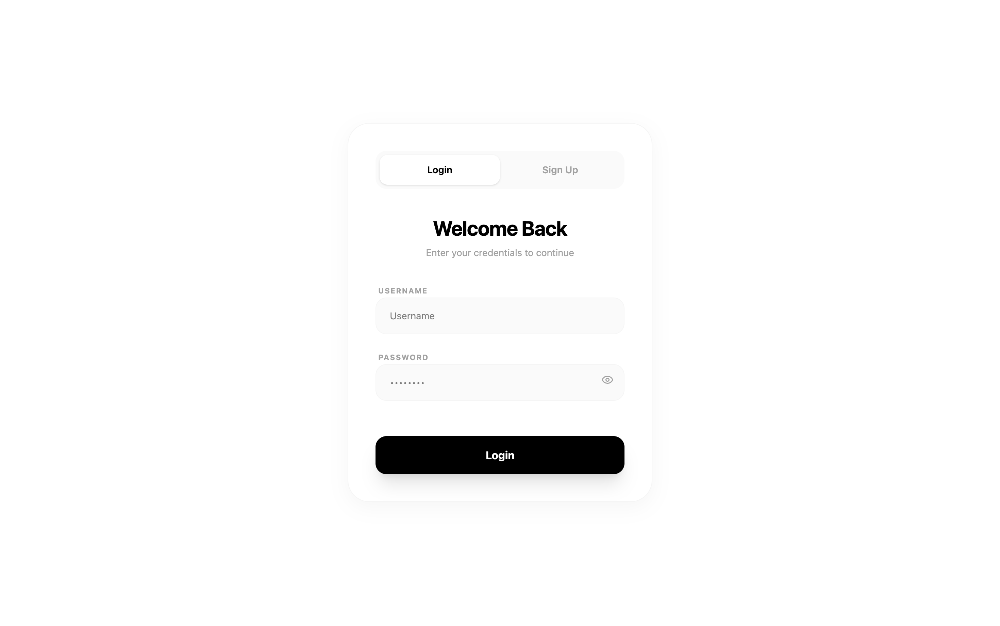
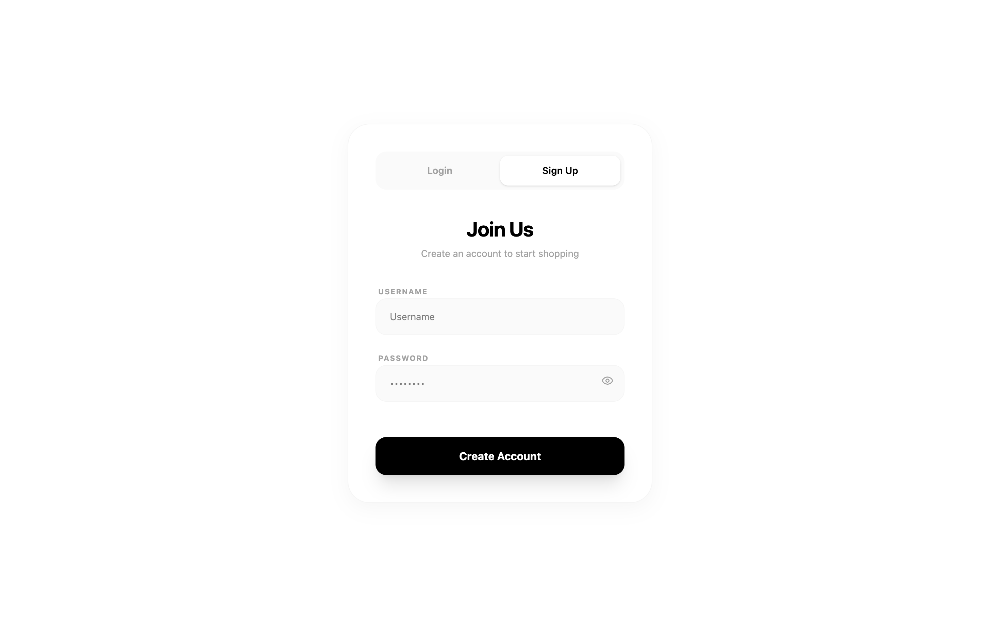
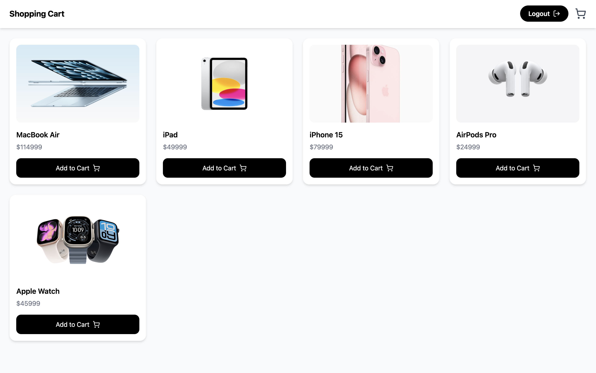
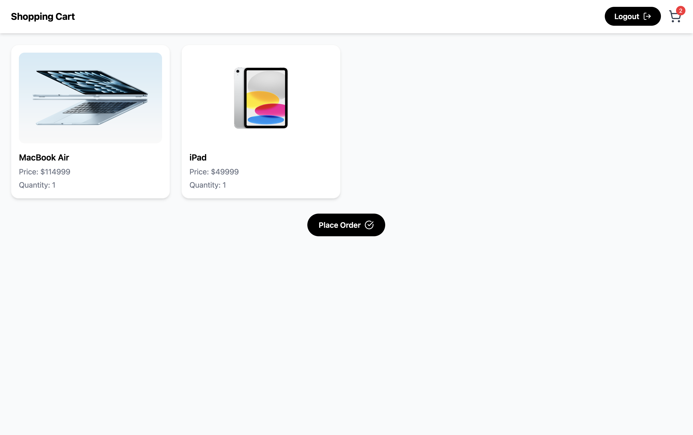
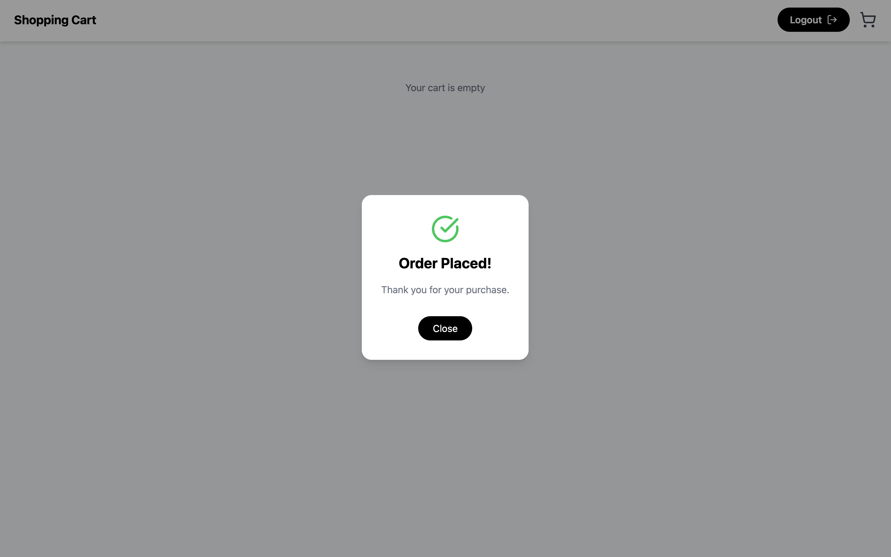

# 🛒 Shopping Cart App

A full-stack **Shopping Cart Web Application** built with **React (Vite)** for the frontend and **Node.js + Express + SQLite** for the backend.
Users can **sign up, log in, browse products, add items to the cart, and place orders**. The app features a modern responsive design using **Tailwind CSS**.

---

## 🚀 Features

- **User Authentication**
  - Sign Up / Login
  - Password validation (uppercase, lowercase, number, special character)

- **Product Browsing**
  - Browse products with images and prices
  - Add items to cart

- **Shopping Cart**
  - View cart items
  - Update quantities
  - Place orders with confirmation modal

- **Responsive UI**
  - Mobile and desktop friendly
  - Smooth animations with Framer Motion

- **Security**
  - JWT-based authentication for API requests

---

## 🛠️ Tech Stack

| Frontend      | Backend            | Database      |
| ------------- | ------------------ | ------------- |
| React (Vite)  | Node.js + Express  | SQLite        |
| Tailwind CSS  | JWT Authentication | Sequelize ORM |
| Framer Motion | REST APIs          | -             |
| Lucide Icons  | -                  | -             |

---

## 📸 Screenshots

**Login Page**



**Signup Page**



**Home / Products Page**



**Cart Page**



**Order Placed Confirmation**



---

## ⚡ Getting Started (Local)

### 1. Clone the repo

```bash
git clone https://github.com/saipreethambathula/shopping-cart.git
cd shopping-cart
```

### 2. Backend Setup

```bash
cd backend
npm install
node server.js
```

The backend runs on `http://localhost:3000`.

### 3. Frontend Setup

```bash
cd frontend
npm install
npm run dev
```

Frontend runs on `http://localhost:5173` (Vite default port).

### 4. Environment Variables

Create a `.env` file in `frontend`:

```env
VITE_API_URL=http://localhost:3000
```

---

## 🌐 Deployment

- **Frontend:** Render / Netlify (Static Site)
- **Backend:** Render / Railway / Heroku (Web Service)

> Make sure to update `VITE_API_URL` in `.env` to point to the deployed backend URL.

---

## 💡 Folder Structure

```
shopping-cart/
│
├── frontend/          # React + Vite frontend
│   ├── src/
│   │   ├── assets/    # Images, screenshots
│   │   ├── pages/     # React pages (Home, Cart, Auth)
│   │   └── App.jsx
│   └── package.json
│
└── backend/           # Node.js + Express backend
    ├── models/        # DB models
    ├── routes/        # API routes
    ├── db/            # SQLite DB
    ├── assets/        # Backend screenshots
    ├── server.js
    └── package.json
```

---

---

> Made with ❤️ by **Preetham Bathula**
